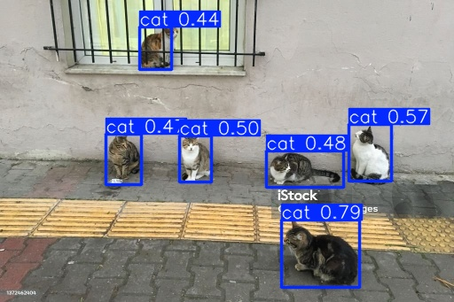

[supported]: https://img.shields.io/badge/-supported-green "supported"

| Chip     | ESP-IDF v5.3           | ESP-IDF v5.4           |
|----------|------------------------|------------------------|
| ESP32-S3 | ![alt text][supported] | ![alt text][supported] |
| ESP32-P4 | ![alt text][supported] | ![alt text][supported] |

# Cat Detect Example

A simple image inference example. In this example, we use ``cat.jpg`` for test. With default setting(iou=0.7, conf=0.25), the detection result before quantization is shown below:



And the detection result of espdet_pico_224_224_cat after int8 quantization on ESP32-P4 is as follows:


## Quick start

Follow the [quick start](https://docs.espressif.com/projects/esp-dl/en/latest/getting_started/readme.html#quick-start) to flash the example, you will see the output in idf monitor:

```
I (1556) cat_detect: [category: 0, score: 0.731059, x1: 317, y1: 248, x2: 402, y2: 322]
I (1556) cat_detect: [category: 0, score: 0.651355, x1: 392, y1: 140, x2: 442, y2: 207]
I (1566) cat_detect: [category: 0, score: 0.622459, x1: 155, y1: 22, x2: 198, y2: 80]
I (1566) cat_detect: [category: 0, score: 0.407333, x1: 300, y1: 169, x2: 381, y2: 210]
I (1576) cat_detect: [category: 0, score: 0.377541, x1: 115, y1: 153, x2: 161, y2: 213]
I (1586) cat_detect: [category: 0, score: 0.294215, x1: 203, y1: 151, x2: 241, y2: 206]

```

## Configurable Options in Menuconfig

### Component configuration
We provide the models as components, each of them has some configurable options.

### Project configuration

- CONFIG_PARTITION_TABLE_CUSTOM_FILENAME

If model location is set to FLASH partition, please set this option to `partitions2.csv`

